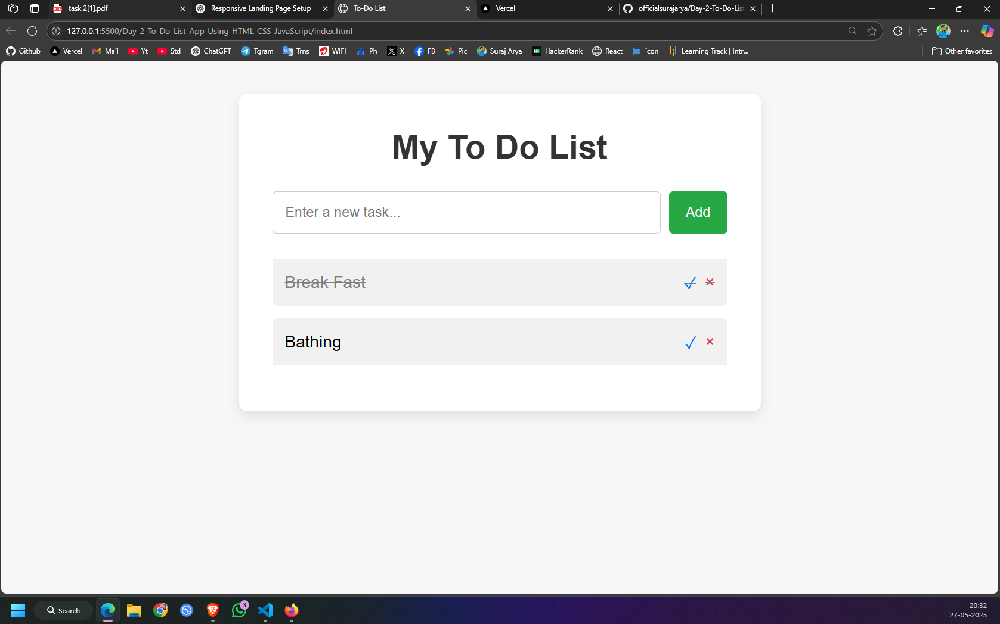

# Day 2: To-Do List App Using HTML, CSS & JavaScript

A simple, responsive To-Do List web app built with HTML, CSS, and Vanilla JavaScript. This app allows users to add, mark complete, and delete tasks dynamically—no page reloads required.

## 📸 Preview

 <!-- Optional: Add a screenshot image -->

## 🚀 Features

- ✅ Add new tasks
- ✅ Mark tasks as complete
- ✅ Delete tasks
- ✅ Instant UI updates
- ✅ Responsive design

## 🛠️ Tech Stack

- HTML5
- CSS3 (Flexbox)
- JavaScript (ES6)

## 📁 Project Structure

